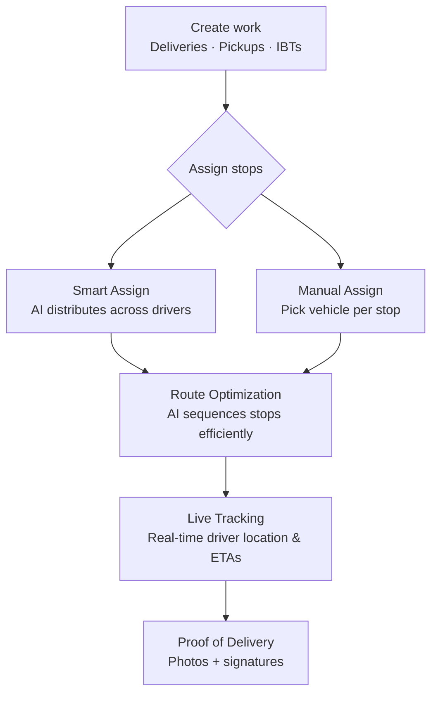

## Nathaniel Y 👋
Building **[Gallop](https://usegallop.com)** — intelligent delivery software for modern teams.

---

  

Gallop is a delivery and route management platform built for teams that handle deliveries, pickups, and fleet operations. Instead of juggling spreadsheets, maps, and messaging apps, everything lives in one place — from planning routes to capturing proof of delivery.

Currently in **beta** — [join the waitlist or try it at usegallop.com →](https://usegallop.com)

---

### Key features

| | Feature | What it does |
|---|---|---|
| 🗺️ | Route optimization | Smarter sequences, fewer miles, less backtracking |
| 🤖 | Smart Assign | Automatically distributes work across your fleet |
| 📍 | Live tracking | Know where every driver is, updated in real time |
| 👥 | Team & fleet management | Manage drivers, vehicles, and branches in one place |
| 📊 | Analytics & reporting | Data to understand and improve your operations |
| 📸 | Proof of delivery | Photos and signatures captured on the driver's phone |

---

---

### See it in action

---

## 🛠️ Tech Stack

---

### How it works

